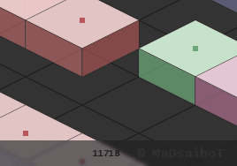

# ISOmetric 2D BrowserGame-Engine Prototype

Javascript game-engine for Isometric 2D
RPG, Strategy, and Simulation Games with Multiplayer capability (utilising WEBsockets)

AS of now the Server is build with the Flask Microframework and a simplified WEBsocket package
it will most likely be swiched out with Quart 

The Client is build in Pure Vanilla Javascript showcasing modern techniques used in
Single Page Applications (SPA) like Routing, WebComponents and DataBinding 
Without the need for Frameworks/Libaries like Angular or React

## latest feature: arrow-key-indicator

